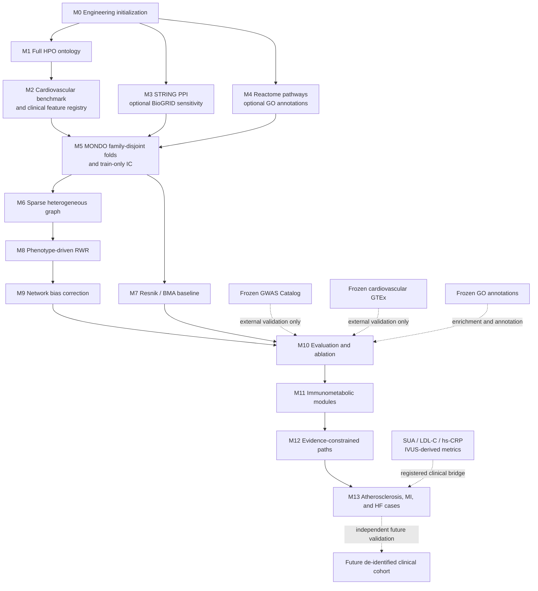

# Milestone Flow

This diagram is the execution contract for V0. Solid arrows are required pipeline dependencies; dashed arrows are validation or future-extension boundaries.

## Stage Gates

- **M2 gate:** canonical identifiers, audit tables, cardiovascular inclusion rules, and clinical-feature mappings are complete.
- **M5 gate:** all MONDO family groups are disjoint and every leakage check passes.
- **M10 gate:** test folds remain untouched by training and tuning; external resources remain frozen and independent.
- **M13 gate:** reports distinguish predictions, database support, clinical associations, and causal claims.

## Scope Boundary

V0 trains only on public disease-level annotations and propagates across HPO, Gene, and Reactome Pathway nodes. Clinical numeric variables do not become graph nodes. The future clinical cohort is a separate validation extension, not an additional training input for V0.